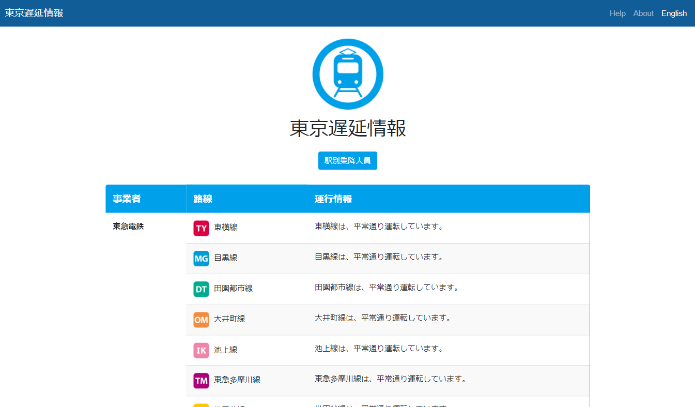
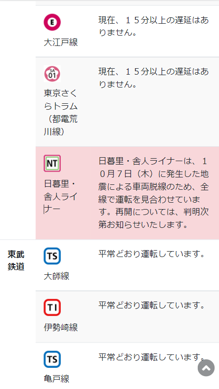
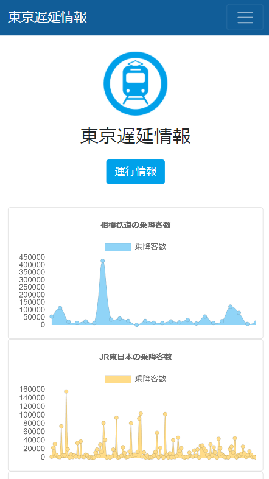

## 現在状況

⚠️オープンデータチャレンジからのAPIは利用することができない状態になったため、サーバーを停止しました。⚠️

# Tokyo Train Delay (東京遅延情報)
[英語のREADME](./README.md)

本アプリケーションは[第4回公共交通オープンデータ](https://tokyochallenge.odpt.org/index.html)の作品です。

本アプリケーションの画面では各路線の運行状況が表示されており、レスポンシブデザインであり、スマートフォンからでも理解しやすいです。また、英語版にも対応しているため、外国人の方でも詳細に各路線の詳細な遅延情報を入手できます。

Twitterアカウント[(@chienjyouhou)](https://twitter.com/chienjyouhou)をフォローして頂いて、 tweet内容から入手したい、路線の情報を入手してもらうことを想定しています。

[ウエブサイトはこちら](https://tokyo-train-delays.herokuapp.com/train/en/)

## 運行情報
遅延情報に該当する内容が赤枠で表示され、どの線が運行に遅延状況を担っているか、把握できるため、すぐに遅延情報を得られます。

## 駅別乗降人数
別ページの駅別乗降人数を表示しています。コロナウイルスの蜜回避の対策が行われていることから、 Tokyo_Open_Dataが所持するデータをもとに乗降人数をグラフで可視化することにより、 自身の利用している各駅の電車の乗降人数、利用者の規模の理解を少しでも深められるよう作成しました。

## Note
本アプリケーションが利用する公共交通データは、[東京公共交通オープンデータチャレンジ](https://tokyochallenge.odpt.org/index.html)において提供されるものです。 また、本アプリケーションの英語の運行情報の表示内容は [IBM Watson Language Translator](https://www.ibm.com/cloud/watson-language-translator)のデータにより提供されています。

必ずしも正確・完全なものとは限りません。本アプリケーションの表示内容について、公共交通事業者への直接の問合せは行わないでください。

本アプリケーションに関するお問い合わせは、以下のメールアドレスにお願いします。

## Contributors
- Webアプリ: Chanon Limpipolpaibul
- Twitterボット: Kohei Horiguchi(堀口紘平)
- アイコン: Shuei Oshikubo(押久保秀英)

[TwitterボットのGithubのレポ](https://github.com/Kohei554/opendata0925)

## License
[MIT](https://choosealicense.com/licenses/mit/)
