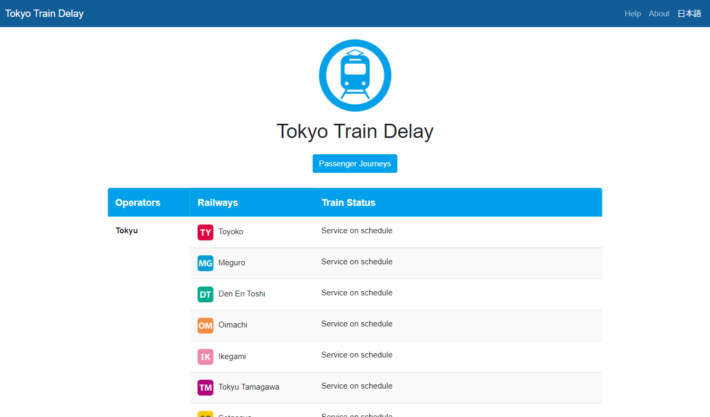
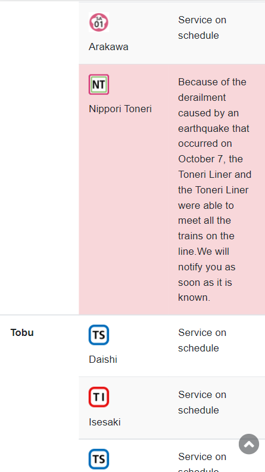
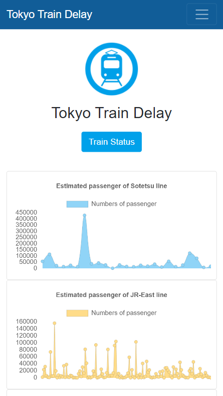

# Tokyo Train Delay
[Japanese README](./README.ja.md)

Tokyo Train Delay web application will be submitted to [4th Open Data Challenge for Public Transportation in Tokyo](https://tokyochallenge.odpt.org/index.html)

Tokyo Train Delay is a web application displayed operation status for the railways in Tokyo. This web application is build with responsive in mind and support both English and Japanese languages.

Please follow the Tokyo Train Delay Twitter account[(@tokyotraindelay)](https://twitter.com/tokyotraindelay) to receive delay information on a timely basis.

[Visit our website here](https://tokyo-train-delays.herokuapp.com/train/en/)

## Train Status Page
This webpage will show the information about the delay information of the train in Tokyo. Operation Status are represented along with railways and operators in a table. Delay information is displayed in red background.

## Passenger Journeys Page
In the Passenger Journeys page, with the goal of encouraging people to avoid crowds due to the COVID-19, this webpage is displayed information about the number of people getting on and off the train with simple design graph.

## Note
The source of the public transportation data in this app is the [Open Data Challenge for Public Transportation in Tokyo](https://tokyochallenge.odpt.org/index.html).

This application data are based on the data provided by the public transportation operators. And the operation status displayed by this application are provided by [IBM Watson Language Translator](https://www.ibm.com/cloud/watson-language-translator). The accuracy and integrity of the data are not guaranteed. Please do not contact the public transportation operators directly regarding the content of the app.

## Contributors
- Web app: Chanon Limpipolpaibul
- Twitter bot: Kohei Horiguchi(堀口紘平)
- Icon: Shuei Oshikubo(押久保秀英)

[Twitter bot Github repositories](https://github.com/Kohei554/opendata0925)

## License
[MIT](https://choosealicense.com/licenses/mit/)
